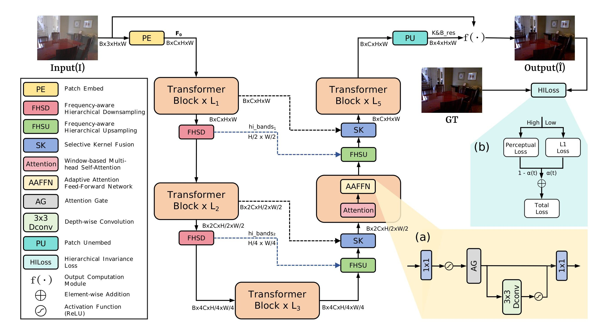

# ED-Former

Official PyTorch implementation of **“ED-Former: Efficient Dehazing Transformer with Attention-Adaptive Feed-Forward Network”**, published in *Signal Processing: Image Communication* (2026).

[[Paper](https://doi.org/10.1016/j.image.2026.117634)] [[ScienceDirect](https://www.sciencedirect.com/science/article/pii/S0923596526001578)]

> Jinrong Chen, Yulin He, Xin Wang, Zhongyuan Guo, Jingtong Chen, Zhe Rao, and Yi Xiang, “ED-Former: Efficient dehazing transformer with Attention-Adaptive Feed-Forward Network,” *Signal Processing: Image Communication*, vol. 148, article 117634, 2026.

ED-Former is an extremely lightweight Transformer for single-image dehazing. It combines a Frequency-aware Hierarchical Sampler (FHS), an Attention-Adaptive Feed-Forward Network (AAFFN), and Hierarchical Invariance Loss (HILoss) to preserve high-frequency details while keeping the model below one million parameters.

## Network architecture

<p align="center">
  
</p>

## Quantitative comparison

<p align="center">
  
</p>

| Dataset | PSNR | SSIM |
|:--|--:|--:|
| SOTS-indoor (RESIDE-IN) | **38.21** | **0.9942** |
| SOTS-outdoor (RESIDE-OUT) | **33.92** | **0.9827** |
| RS-Haze | **39.61** | **0.9715** |

The model has 0.866 M parameters and requires 7.36 G MACs for a 256 × 256 input.

## Qualitative comparison

<p align="center">
  <a href="figs/Qualitative%20Comparison.png">
    
  </a>
</p>

Qualitative comparisons with state-of-the-art dehazing methods on indoor, outdoor, and real-world hazy images. Click the image to view fine-grained details at full resolution.

## Results

The benchmark summaries are included directly in this repository:

| Benchmark | Metric file | Dehazed images |
|:--|:--|:--|
| SOTS-indoor | [`results/RESIDE-IN/ed-former/38.21 \| 0.9942.csv`](results/RESIDE-IN/ed-former/38.21%20%7C%200.9942.csv) | `results/RESIDE-IN/ed-former/imgs/` |
| SOTS-outdoor | [`results/RESIDE-OUT/ed-former/33.92 \| 0.9827.csv`](results/RESIDE-OUT/ed-former/33.92%20%7C%200.9827.csv) | `results/RESIDE-OUT/ed-former/imgs/` |
| RS-Haze | [`results/RSHaze/ed-former/39.61 \| 0.9715.csv`](results/RSHaze/ed-former/39.61%20%7C%200.9715.csv) | `results/RSHaze/ed-former/imgs/` |

To keep the Git repository lightweight, the complete per-image outputs for all three benchmarks are packaged as `ED-Former-complete-results.tar.gz` in the [latest GitHub Release](../../releases/latest). After running `test.py`, newly generated dehazed images and per-image metrics are saved under `results/<DATASET>/ed-former/` using the same layout.

## Installation

The code is written in Python and requires PyTorch. A CUDA-enabled GPU is required by the current testing script.

```bash
git clone https://github.com/2697166190a-beep/ED-Former.git
cd ED-Former

conda create -n edformer python=3.7 -y
conda activate edformer
pip install -r requirements.txt
```

If the PyTorch build installed by `pip` does not match your CUDA version, install the appropriate build by following the [official PyTorch installation guide](https://pytorch.org/get-started/locally/), then run `pip install -r requirements.txt` again.

## Data preparation

Download RESIDE Indoor Training Set / SOTS-indoor, RESIDE Outdoor Training Set / SOTS-outdoor, and RS-Haze from their official sources. Arrange paired hazy and ground-truth images as follows. A hazy image and its ground truth must have the same filename.

```text
data/
├── RESIDE-IN/
│   ├── train/
│   │   ├── hazy/
│   │   └── GT/
│   ├── valid/
│   │   ├── hazy/
│   │   └── GT/
│   └── test/
│       ├── hazy/
│       └── GT/
├── RESIDE-OUT/
│   ├── train/
│   │   ├── hazy/
│   │   └── GT/
│   └── test/
│       ├── hazy/
│       └── GT/
└── RSHaze/
    ├── train/
    │   ├── hazy/
    │   └── GT/
    └── test/
        ├── hazy/
        └── GT/
```

## Pretrained models

The pretrained checkpoints are included in this repository:

```text
saved_models/
├── indoor/ed-former.pth
├── outdoor/ed-former.pth
└── rshaze/ed-former.pth
```

## Testing

Run the command for the desired benchmark:

```bash
# SOTS-indoor
python test.py --model ed-former --dataset RESIDE-IN --exp indoor

# SOTS-outdoor
python test.py --model ed-former --dataset RESIDE-OUT --exp outdoor

# RS-Haze
python test.py --model ed-former --dataset RSHaze --exp rshaze
```

Dehazed images and a CSV file containing per-image PSNR/SSIM values are written to `results/<DATASET>/ed-former/`.

## Training

The experiment settings are stored in `configs/indoor/ed-former.json`, `configs/outdoor/ed-former.json`, and `configs/rshaze/ed-former.json`.

```bash
# RESIDE indoor
python train.py --model ed-former --dataset RESIDE-IN --exp indoor \
  --lambda_l1_start 0.1 --lambda_l1_end 1.0

# RESIDE outdoor
python train.py --model ed-former --dataset RESIDE-OUT --exp outdoor \
  --lambda_l1_start 0.5 --lambda_l1_end 0.9

# RS-Haze
python train.py --model ed-former --dataset RSHaze --exp rshaze \
  --lambda_l1_start 0.1 --lambda_l1_end 1.0
```

These commands are also collected in [`run.sh`](run.sh). Training will not overwrite an existing checkpoint. Remove or move the corresponding file under `saved_models/<EXP>/` before retraining from scratch.

To use a different dataset root, add `--data_dir /path/to/data` to a training or testing command. You can similarly change output locations with `--save_dir`, `--log_dir`, and `--result_dir` where supported.

## Repository structure

```text
ED-Former/
├── configs/                    # Training configurations
├── figs/                       # Architecture and comparison figures
├── results/                    # Benchmark metric CSV files
├── saved_models/               # Pretrained checkpoints
├── ED_Former.py                # Network definition
├── HierarchicalInvarianceLoss.py
├── loader.py                   # Paired image data loader
├── train.py
├── test.py
├── run.sh                      # Example training/testing commands
└── requirements.txt
```

## Citation

If this work is useful for your research, please cite:

```bibtex
@article{chen2026edformer,
  title   = {ED-Former: Efficient dehazing transformer with Attention-Adaptive Feed-Forward Network},
  author  = {Chen, Jinrong and He, Yulin and Wang, Xin and Guo, Zhongyuan and Chen, Jingtong and Rao, Zhe and Xiang, Yi},
  journal = {Signal Processing: Image Communication},
  volume  = {148},
  pages   = {117634},
  year    = {2026},
  doi     = {10.1016/j.image.2026.117634}
}
```

## Acknowledgements

Parts of this codebase are based on the excellent [DehazeFormer](https://github.com/IDKiro/DehazeFormer) implementation. We sincerely thank Yuda Song, Zhuqing He, Hui Qian, and Xin Du for making their work publicly available. We also thank the authors and maintainers of the public datasets and other open-source projects used in this work.
